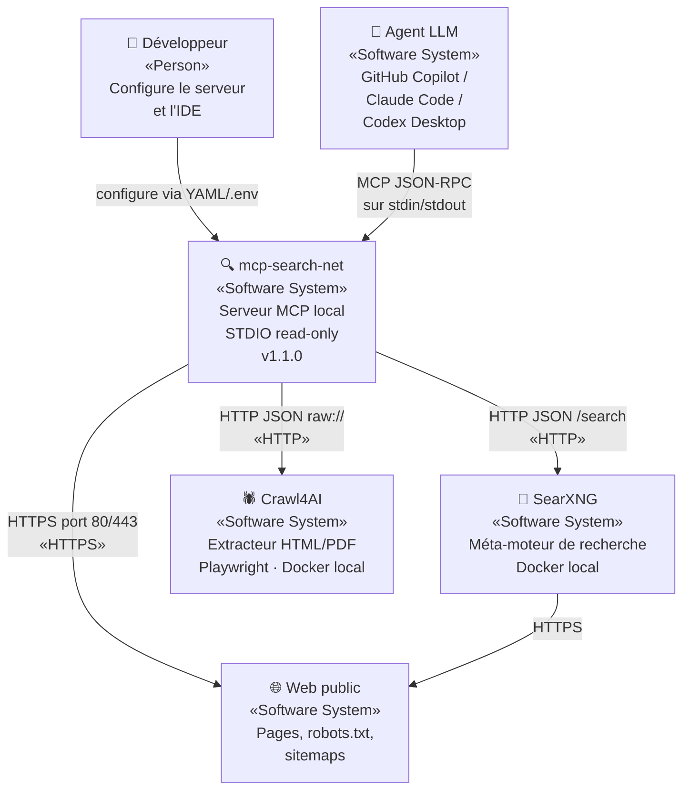

# Section 3 — Contexte et périmètre

> arc42 · mcp-search-net v1.1.0 · 2026-08-08

---

## 3.1 Frontière du système

`mcp-search-net` est un processus local lancé par un IDE ou un assistant IA. Il reçoit des appels MCP via `stdin` et retourne des réponses JSON-RPC via `stdout`. Il ne stocke aucun secret utilisateur et ne rappelle jamais le client LLM de sa propre initiative.

### Ce qui est **dans** le périmètre

- Réception et validation des appels MCP (5 outils + 4 resources statiques + 9 resource templates)
- Recherche Web via SearXNG local
- Extraction de contenu via la passerelle HTTP sécurisée et Crawl4AI
- Cache opportuniste Web (`cache.sqlite`)
- Catalogue documentaire local (`catalog.db`) : ingestion, synchronisation, recherche FTS5
- CLI de gestion du catalogue (`catalog init/sync/search/…`)
- Installateur Windows (ZIP portable + Inno Setup)

### Ce qui est **hors** périmètre

- Exécution d'un LLM ou appel à une API IA
- Synchronisation automatique du catalogue (toujours déclenchée manuellement ou par CLI)
- Crawler Web autonome (pas de suivi de liens)
- Authentification ou gestion de session utilisateur

---

## 3.2 Acteurs et systèmes externes

| Acteur / Système | Type | Rôle | Interface |
|---|---|---|---|
| **Développeur** | Personne | Configure, installe et utilise le serveur via son IDE ou un client MCP | Configuration YAML / variables d'environnement |
| **Agent LLM** (Copilot, Claude, Codex…) | Système logiciel externe | Appelle les outils MCP pour enrichir son contexte | MCP STDIO JSON-RPC |
| **SearXNG** | Système logiciel externe (Docker local) | Moteur de méta-recherche Web | HTTP JSON (`/search?format=json`) |
| **Crawl4AI** | Système logiciel externe (Docker local) | Extraction de contenu HTML/PDF avec Playwright | HTTP JSON (`raw://` document neutralisé) |
| **Internet (Web public)** | Système externe | Pages, sitemaps, `robots.txt` récupérés par la passerelle sécurisée | HTTPS (ports 80/443 uniquement) |
| **Système de fichiers local** | Infrastructure | Stockage des bases SQLite, de la configuration et des clés secrètes locales | Fichiers sur disque |
| **Docker Engine** | Infrastructure | Exécution conteneurisée de SearXNG et Crawl4AI | Docker Compose |

---

## 3.3 Diagramme C4 Level 1 — Contexte

---

## 3.4 Interfaces

### Interface MCP (entrée)

- **Protocole** : JSON-RPC 2.0 via STDIO
- **SDK** : `@modelcontextprotocol/sdk@1.30.0`
- **Outils exposés** : `search_web`, `fetch_url`, `search_docs`, `list_docs`, `read_doc_section`
- **Resources** : 4 statiques + 9 templates (`mcp-search-net://…`)
- **Schéma de version** : `schemaVersion = "1.0"` dans les réponses JSON
- **Annotations** : tous les outils sont `readOnlyHint=true`, `destructiveHint=false`, `idempotentHint=true`

### Interface SearXNG (sortie)

- **URL** : `http://127.0.0.1:8888` (mode hybride) ou `http://searxng:8080` (mode Docker)
- **Méthode** : `GET /search?q=…&format=json`
- **Timeout** : 15 s par défaut

### Interface Crawl4AI (sortie)

- **URL** : `http://127.0.0.1:11235` (mode hybride) ou `http://crawl4ai:11235` (mode Docker)
- **Authentification** : token Bearer (`MCP_CRAWL4AI_TOKEN`)
- **Entrée** : document HTML `raw://` préalablement neutralisé
- **Timeout** : 20 s par défaut

### Interface système de fichiers

| Chemin | Rôle |
|---|---|
| `config/application.yml` | Configuration principale YAML |
| `config/official-sources.yml` | Registre des sources officielles |
| `.data/cache.sqlite` | Cache Web V1 (supprimable) |
| `.data/catalog.db` | Catalogue documentaire V2 (durable) |
| `.env` | Secrets locaux (chargé au démarrage si présent) |
