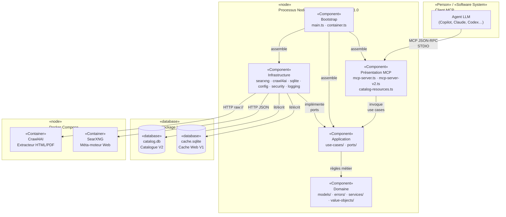
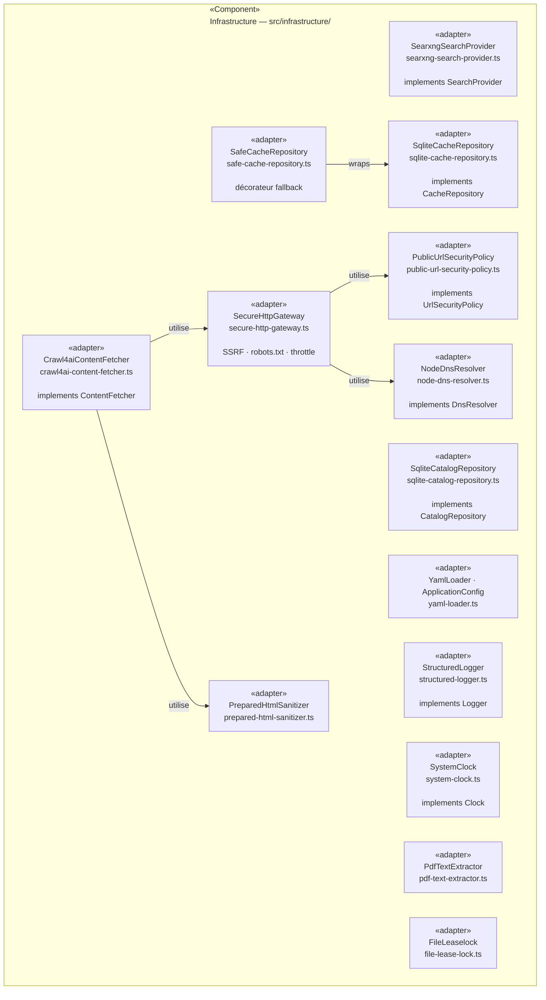
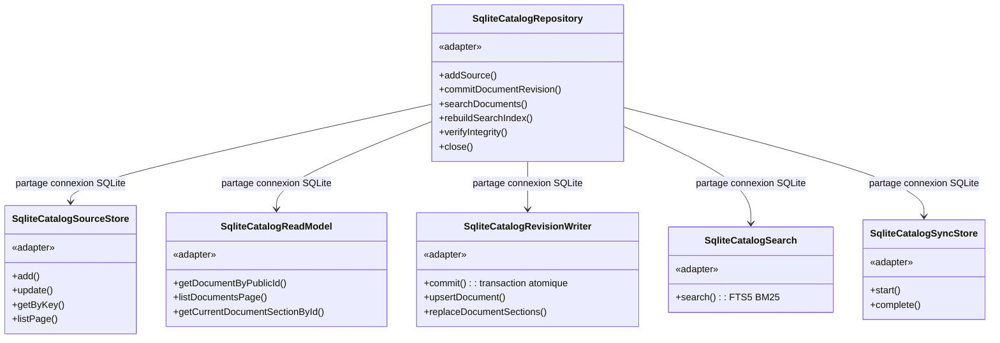
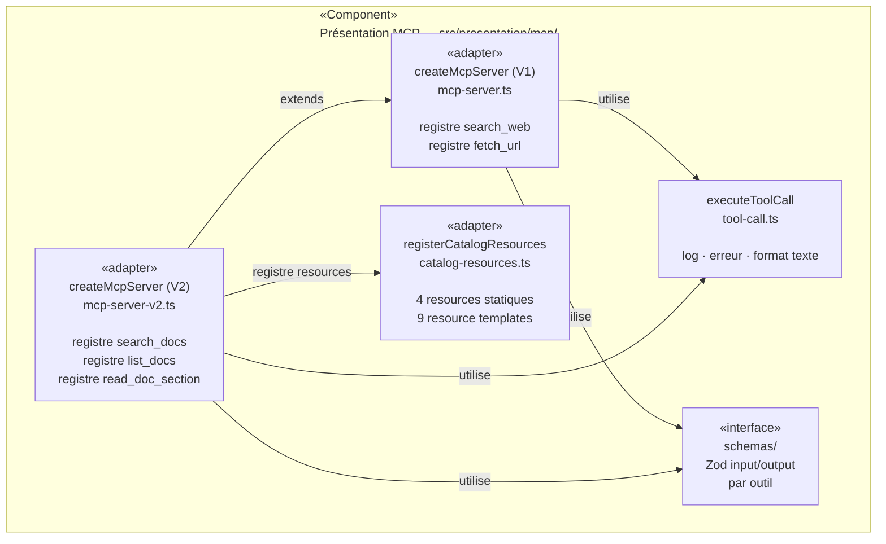
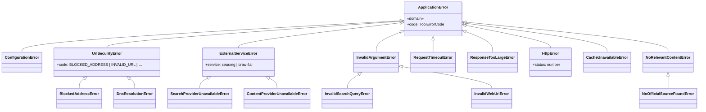

# Section 5 — Vue des blocs (statique)

> arc42 · mcp-search-net v1.1.0 · 2026-08-08

---

## 5.1 Diagramme C4 Level 2 — Container

Le processus Node.js est le seul conteneur applicatif. Il embarque toutes les couches et s'appuie sur deux bases SQLite et deux services Docker externes.

---

## 5.2 Diagramme C4 Level 3 — Composants de la couche Application

```mermaid
flowchart TB
    subgraph uc["«Component»\nCas d'usage — src/application/use-cases/"]
        sw["SearchWeb\nsearch-web.ts"]
        fu["FetchUrl\nfetch-url.ts"]
        scd["SearchCatalogDocuments\nsearch-catalog-documents.ts"]
        lcs["LoadCatalogSources\nload-catalog-sources.ts"]
        sync["SyncCatalogDocuments\nsync-catalog-documents.ts"]
        mc["MaintainCatalog\nmaintain-catalog.ts"]
        ri["RebuildCatalogIndex\nrebuild-catalog-index.ts"]
        pc["PurgeCatalogVersions\npurge-catalog-versions.ts"]
        vc["VerifyCatalog\nverify-catalog.ts"]
    end

    subgraph ports["«interface»\nPorts — src/application/ports/"]
        sp["SearchProvider"]
        cf["ContentFetcher"]
        cr["CacheRepository"]
        cat["CatalogRepository"]
        osr["OfficialSourceRegistry"]
        usp["UrlSecurityPolicy"]
        dns["DnsResolver"]
        clk["Clock"]
        log["Logger"]
    end

    sw -- "utilise" --> sp
    sw -- "utilise" --> cr
    sw -- "utilise" --> osr
    fu -- "utilise" --> cf
    fu -- "utilise" --> cr
    fu -- "utilise" --> usp
    fu -- "utilise" --> osr
    scd -- "utilise" --> cat
    lcs -- "utilise" --> cat
    sync -- "utilise" --> cat
    sync -- "utilise" --> cf
    mc -- "utilise" --> cat
    ri -- "utilise" --> cat
    pc -- "utilise" --> cat
    vc -- "utilise" --> cat
```

---

## 5.3 Diagramme C4 Level 3 — Composants de la couche Infrastructure

---

## 5.4 Composants du catalogue SQLite (zoom interne)

`SqliteCatalogRepository` est une façade qui délègue à cinq classes spécialisées partageant **une seule connexion SQLite** (intentionnel pour les transactions atomiques).

---

## 5.5 Composants de la couche Présentation MCP

---

## 5.6 Hiérarchie des erreurs du domaine

---

## 5.7 Référence des fichiers source par composant

| Composant               | Fichier(s) principal(aux)                                                                            |
| ----------------------- | ---------------------------------------------------------------------------------------------------- |
| Bootstrap               | `src/bootstrap/main.ts`, `src/bootstrap/container.ts`, `src/bootstrap/runtime-guard.ts`              |
| MCP Server V1           | `src/presentation/mcp/mcp-server.ts`                                                                 |
| MCP Server V2           | `src/presentation/mcp/mcp-server-v2.ts`                                                              |
| Catalog Resources       | `src/presentation/mcp/catalog-resources.ts`                                                          |
| Tool execution          | `src/presentation/mcp/tool-call.ts`                                                                  |
| SearchWeb               | `src/application/use-cases/search-web.ts`                                                            |
| FetchUrl                | `src/application/use-cases/fetch-url.ts`                                                             |
| SearchCatalogDocuments  | `src/application/use-cases/search-catalog-documents.ts`                                              |
| SyncCatalogDocuments    | `src/application/use-cases/sync-catalog-documents.ts`                                                |
| Ports (interfaces)      | `src/application/ports/*.ts`                                                                         |
| Domain models           | `src/domain/models/*.ts`, `src/domain/value-objects/*.ts`                                            |
| Domain errors           | `src/domain/errors/domain-errors.ts`                                                                 |
| SearxngSearchProvider   | `src/infrastructure/search/searxng-search-provider.ts`                                               |
| Crawl4aiContentFetcher  | `src/infrastructure/fetch/crawl4ai-content-fetcher.ts`                                               |
| SecureHttpGateway       | `src/infrastructure/fetch/secure-http-gateway.ts`                                                    |
| PreparedHtmlSanitizer   | `src/infrastructure/fetch/prepared-html-sanitizer.ts`                                                |
| PublicUrlSecurityPolicy | `src/infrastructure/security/public-url-security-policy.ts`                                          |
| SqliteCacheRepository   | `src/infrastructure/cache/sqlite-cache-repository.ts`                                                |
| SqliteCatalogRepository | `src/infrastructure/catalog/sqlite-catalog-repository.ts`                                            |
| Configuration           | `src/infrastructure/config/application-config.ts`, `src/infrastructure/config/load-configuration.ts` |
| StructuredLogger        | `src/infrastructure/logging/structured-logger.ts`                                                    |
