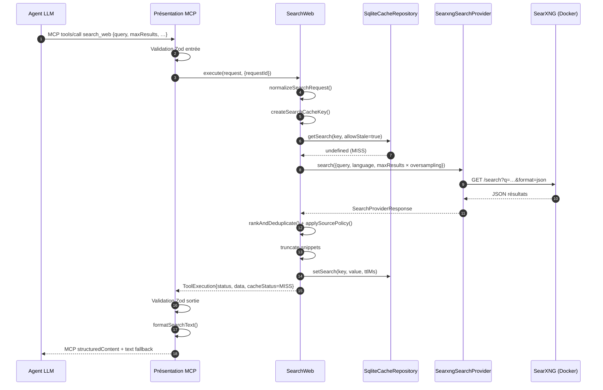
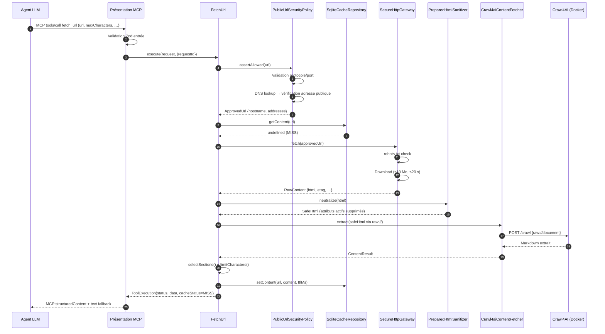
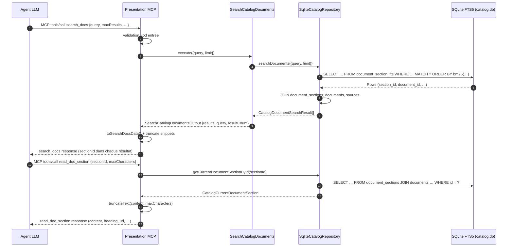
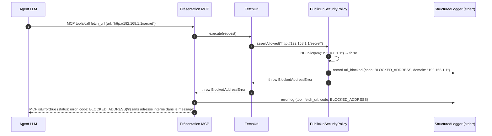
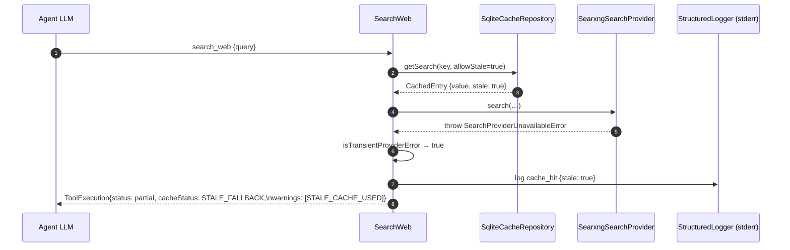
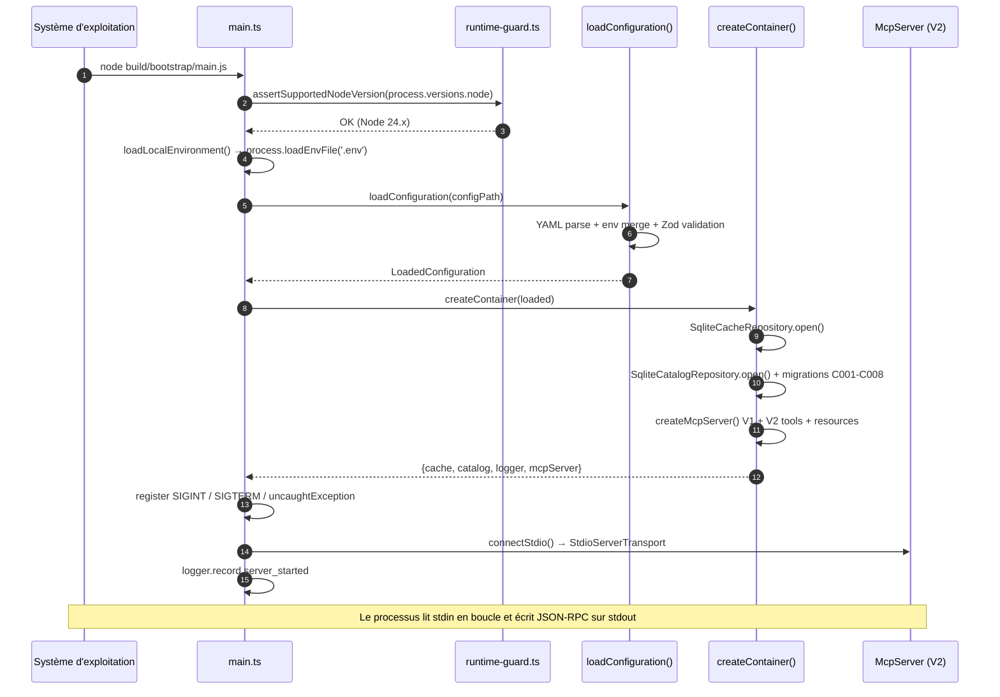

# Section 6 — Vue d'exécution (dynamique)

> arc42 · mcp-search-net v1.1.0 · 2026-08-08

Les noms d'acteurs sont strictement cohérents avec ceux de la [section 5](05-vue-blocs.md).

---

## 6.1 Scénario nominal — Recherche Web (`search_web`)

---

## 6.2 Scénario nominal — Extraction de contenu (`fetch_url`)

---

## 6.3 Scénario nominal — Recherche documentaire (`search_docs` + `read_doc_section`)

---

## 6.4 Scénario d'erreur — URL bloquée par SSRF

---

## 6.5 Scénario d'erreur — Panne SearXNG avec stale fallback

---

## 6.6 Scénario d'exploitation — Démarrage du processus

