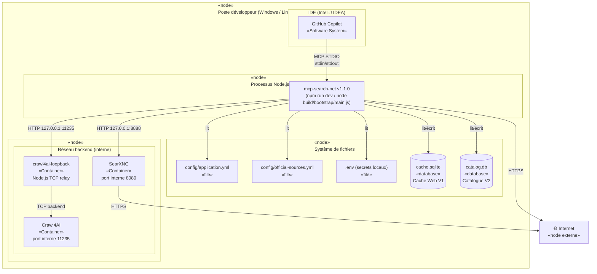
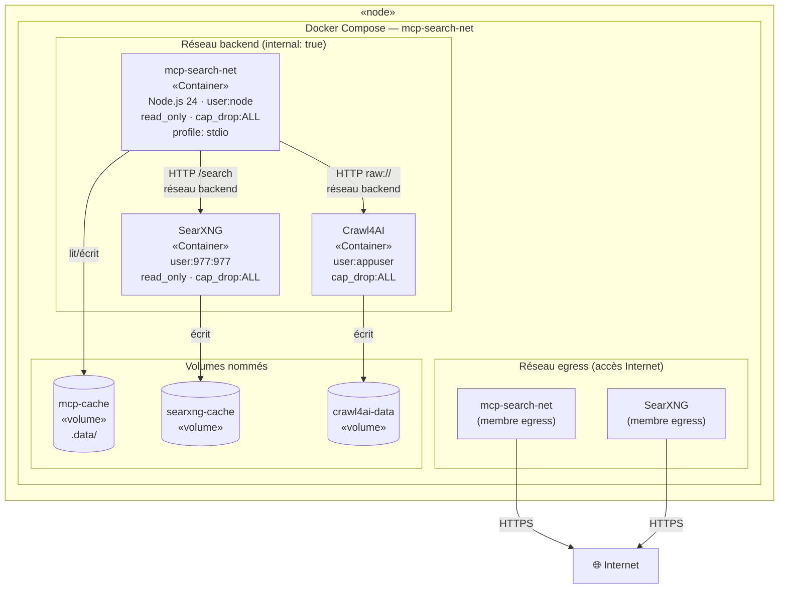
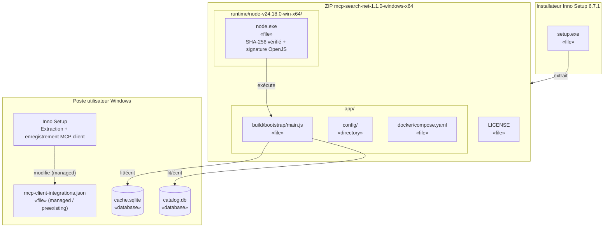

# Section 7 — Vue de déploiement

> arc42 · mcp-search-net v1.1.0 · 2026-08-08

---

## 7.1 Environnements

| Environnement | Description | Spécificités |
|---|---|---|
| **Développement local** | Source + `npm run dev` + Docker Compose hybrid | Mode overlay `compose.hybrid.yaml`, SearXNG sur `127.0.0.1:8888`, relais Crawl4AI sur `127.0.0.1:11235` |
| **Conteneurisé Docker** | `docker compose --profile stdio run mcp-search-net` | Réseau `backend` interne, réseau `egress` pour le Web |
| **Windows portable** | ZIP `mcp-search-net-1.1.0-windows-x64.zip` | Node.js 24.18.0 embarqué, installateur Inno Setup |
| **CI GitHub Actions** | Ubuntu + Node 24 + Docker | Jobs : Node.js validation, Docker integration, Windows packaging |

---

## 7.2 Diagramme de déploiement — Mode développement hybride

---

## 7.3 Diagramme de déploiement — Mode Docker conteneurisé

---

## 7.4 Diagramme de déploiement — Distribution Windows portable

---

## 7.5 Protocoles et ports

| Connexion | Protocole | Port(s) | Remarque |
|---|---|---|---|
| Client MCP → mcp-search-net | STDIO (JSON-RPC 2.0) | — | Pas de port réseau |
| mcp-search-net → SearXNG (local) | HTTP | 8080 (Docker) / 8888 (hybride) | Réseau Docker `backend` interne |
| mcp-search-net → Crawl4AI (local) | HTTP | 11235 | Réseau Docker `backend` / relais loopback |
| mcp-search-net → Web public | HTTPS | 80, 443 | Via réseau `egress` ou hôte direct |
| SearXNG → Web public | HTTPS | 443 | Via réseau `egress` |

---

## 7.6 Sécurité du déploiement

| Mesure | Détail |
|---|---|
| Images figées par digest | `searxng@sha256:d0f6ccf9…` / `crawl4ai@sha256:385042cb…` / `node@sha256:6f7b03f7…` |
| Moindre privilège | `user: node` / `user: 977:977` / `user: appuser` ; `cap_drop: ALL` ; `no-new-privileges: true` |
| Filesystem en lecture seule | `read_only: true` sur `mcp-search-net` et `searxng` ; tmpfs dédié |
| Crawl4AI sans egress | Confiné au réseau `backend` ; accès Internet uniquement via relais minimal (mode hybride) |
| Runtime Node.js signé | SHA-256 officiel + signature OpenJS vérifiés avant activation (installateur Windows) |
| Label OCI propriétaire | `LicenseRef-mcp-search-net-Proprietary` + `LICENSE` embarqué dans l'image |
