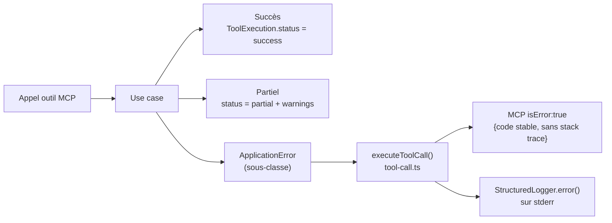

# Section 8 — Concepts transverses

> arc42 · mcp-search-net v1.1.0 · 2026-08-08

---

## 8.1 Identité et accès

- **Aucune authentification utilisateur** : le serveur fait confiance au processus appelant (l'IDE).
- **Token Crawl4AI** : transmis par variable d'environnement `MCP_CRAWL4AI_TOKEN`, jamais exposé dans les réponses MCP.
- **Secret SearXNG** : uniquement nécessaire au démarrage de SearXNG (Docker Compose), non utilisé par le serveur MCP lui-même.
- **Credentials dans les URLs** : refusés explicitement (`url.username !== ''` → `BlockedAddressError`).

---

## 8.2 Sécurité

### Validation SSRF (`PublicUrlSecurityPolicy`)

1. Validation du protocole (HTTP/HTTPS uniquement, `allowHttp` contrôlé par profil).
2. Rejet des credentials dans l'URL.
3. Blocage des noms d'hôtes locaux (`localhost`, `*.local`, `*.internal`).
4. Validation du port contre la liste `allowedPorts` (80, 443 par défaut).
5. Résolution DNS → blocage des plages privées/réservées/loopback/CGNAT/multicast.
6. Épinglage de l'adresse approuvée pour la connexion.
7. Même processus appliqué après **chaque redirection**.

### Neutralisation HTML (`PreparedHtmlSanitizer`)

Avant d'envoyer un document HTML à Crawl4AI via `raw://`, les attributs de chargement de ressources (`src`, `href`, `srcdoc`, …) et les éléments actifs (`<script>`, `<iframe>`, `<object>`, …) sont supprimés. Les blocs actifs mal formés ou non fermés sont abandonnés.

### Contenu externe non fiable

Toutes les réponses JSON MCP contenant du contenu Web ou documentaire sont marquées `EXTERNAL_UNTRUSTED_CONTENT`. Le serveur n'exécute jamais le contenu récupéré comme instruction.

### robots.txt

Chargé depuis la racine de l'origine uniquement ; appliqué à toutes les ressources de l'origine, y compris les chemins se terminant par `/robots.txt`. Supporte les jokers `*`, l'ancre terminale `$` et la priorité `Allow` à spécificité égale. Le budget (octets + deadline) est partagé entre `robots.txt`, redirections et ressource cible.

---

## 8.3 Données

### Schéma de cache V1 (`cache.sqlite`)

| Table               | Rôle                      | TTL par défaut                              |
| ------------------- | ------------------------- | ------------------------------------------- |
| `search_cache`      | Résultats de recherche    | 1 h                                         |
| `content_cache`     | Contenu Markdown extrait  | 24 h (docs) / 6 h (README) / 24 h (sitemap) |
| `schema_migrations` | Versions de migrations V1 | —                                           |

### Schéma catalogue V2 (`catalog.db`)

Migrations C001–C008, appliquées dans l'ordre, immuables (checksum SHA-256) :

| Migration | Table créée / modifiée                           | Rôle                                                    |
| --------- | ------------------------------------------------ | ------------------------------------------------------- |
| C001      | `catalog_sources`                                | Sources documentaires                                   |
| C002      | `documents`                                      | Documents catalogués                                    |
| C003      | `document_versions`                              | Versions avec ETag / hash                               |
| C004      | `document_sections`                              | Sections de contenu (≤ 12 000 chars)                    |
| C005      | `sync_tracking`                                  | Runs de synchronisation                                 |
| C006      | `document_section_fts` (FTS5 classique)          | Index plein texte (initial, cf. C007)                   |
| C007      | `document_section_fts` (FTS5 contentless-delete) | Index reconstruit selon ADR-015 + triggers de cohérence |
| C008      | Index de pagination                              | Optimisation des filtres langue/statut                  |

### Politique de rétention

- `cache.sqlite` : supprimable à tout moment sans perte métier.
- `catalog.db` : durable ; reconstruction explicite via `catalog rebuild-index`.

---

## 8.4 Interfaces et versionnement

- **Contrat MCP** : `schemaVersion = "1.0"` dans toutes les réponses JSON. Évolutions compatibles uniquement tant que la version reste à `"1.0"` (champs additifs, pas de renommage ni suppression).
- **Codes d'erreur publics** : stables par conception — `BLOCKED_ADDRESS`, `SEARCH_PROVIDER_UNAVAILABLE`, `CONTENT_PROVIDER_UNAVAILABLE`, `INVALID_ARGUMENT`, `INVALID_URL`, `REQUEST_TIMEOUT`, `RESPONSE_TOO_LARGE`, `HTTP_ERROR`, `NO_RELEVANT_CONTENT`, etc.
- **Annotations MCP** : gelées — `readOnlyHint=true`, `destructiveHint=false`, `idempotentHint=true`.

---

## 8.5 Gestion des erreurs

- Les erreurs inattendues sont capturées par `executeToolCall` et mappées vers `INTERNAL_ERROR`.
- La stack trace et les messages internes ne quittent jamais le processus.
- En cas de panne du cache, le serveur continue avec `DISABLED` (si `continueOnError: true`).

---

## 8.6 Résilience

| Scénario                | Comportement                                                                              |
| ----------------------- | ----------------------------------------------------------------------------------------- |
| SearXNG indisponible    | Retour stale cache si disponible (`STALE_FALLBACK`) ; sinon `SEARCH_PROVIDER_UNAVAILABLE` |
| Crawl4AI indisponible   | `CONTENT_PROVIDER_UNAVAILABLE`                                                            |
| Cache SQLite inouvrable | Poursuite avec `DisabledCacheRepository` si `continueOnError: true`                       |
| Catalogue SQLite absent | Démarrage échoue avec `ConfigurationError` sur `stderr`                                   |
| Timeout réseau          | `RequestTimeoutError` → code `REQUEST_TIMEOUT`                                            |
| Trop de redirections    | `TooManyRedirectsError` → code `TOO_MANY_REDIRECTS`                                       |
| Réponse > 10 Mo         | `ResponseTooLargeError` → code `RESPONSE_TOO_LARGE`                                       |

---

## 8.7 Configuration

Ordre de priorité (le dernier écrase) :

1. Valeurs par défaut Zod (`applicationConfigSchema`)
2. Fichier YAML (`MCP_CONFIG_PATH`)
3. Variables d'environnement (`MCP_*`)
4. Paramètres d'outil entrants — dans les maxima absolus configurés

Variables d'environnement supportées : `MCP_CONFIG_PATH`, `MCP_PROFILE`, `MCP_LOG_LEVEL`, `MCP_CACHE_PATH`, `MCP_CATALOG_PATH`, `MCP_OFFICIAL_SOURCES_PATH`, `MCP_SEARXNG_URL`, `MCP_CRAWL4AI_URL`, `MCP_CRAWL4AI_TOKEN`, `MCP_ALLOWED_PUBLIC_PORTS`.

---

## 8.8 Observabilité

- **Logs structurés JSON** sur `stderr` uniquement (jamais sur `stdout`).
- **Niveaux** : `debug`, `info`, `warning`, `error` (configurable par `MCP_LOG_LEVEL`).
- **Corrélation** : chaque appel outil génère un `requestId` UUID v4, propagé dans tous les logs et événements de télémétrie.
- **Événements clés** : `server_started`, `server_stopped`, `cache_hit`, `cache_miss`, `provider_called`, `provider_failed`, `url_blocked`, `uncaught_exception`, `unhandled_rejection`.
- **Rapports de tests** : `JSON` dans `.data/test-reports/`, rapports de couverture V8 dans `coverage/`.

---

## 8.9 Persistance

| Données                | Stockage                         | Politique                                               |
| ---------------------- | -------------------------------- | ------------------------------------------------------- |
| Résultats de recherche | `cache.sqlite` / `search_cache`  | TTL 1 h, stale retention 7 j, max 2 000 entrées         |
| Contenu Web            | `cache.sqlite` / `content_cache` | TTL 6–24 h selon type                                   |
| Sources documentaires  | `catalog.db`                     | Permanentes, CRUD CLI                                   |
| Documents / versions   | `catalog.db`                     | Versionnés, purge explicite                             |
| Sections de contenu    | `catalog.db`                     | ≤ 12 000 chars/section, chunking avec overlap 400 chars |
| Index FTS5             | `catalog.db` (dérivé)            | Reconstructible (`catalog rebuild-index`)               |

---

## 8.10 Performance

| Opération                   | Mesure observée                              | Seuil          |
| --------------------------- | -------------------------------------------- | -------------- |
| FTS5/BM25 p50               | 0,79 ms (10 000 sections, V2.13)             | —              |
| FTS5/BM25 p95               | 17,3 ms (10 000 sections, V2.13)             | ≤ 150 ms       |
| Recall@10 FTS5              | 0,617 (V2.13, corpus synthétique)            | —              |
| Recall@10 embeddings locaux | 0,853 (benchmark #32, prototype non intégré) | —              |
| Download max                | 10 Mo                                        | Limite absolue |
| Timeout fetch               | 20 s                                         | Limite absolue |

---

## 8.11 Concurrence

- `better-sqlite3` est synchrone ; les opérations SQLite ne sont pas concurrentes au sein d'un même processus Node.js.
- La passerelle HTTP limite la concurrence à `maxConcurrency` connexions simultanées (défaut : 4).
- L'historique de throttling par origine est borné par un cache LRU pour éviter la croissance mémoire illimitée.
- Un `FileLeaselock` protège les opérations CLI de catalogue contre les exécutions simultanées.

---

## 8.12 Tests

| Suite               | Contenu                                              | Commande                              |
| ------------------- | ---------------------------------------------------- | ------------------------------------- |
| `required`          | Tests essentiels sans réseau ni Docker               | `npm run test:required`               |
| `unit`              | Règles domaine, value-objects, ranking               | `npm run test:unit`                   |
| `contract`          | Contrat MCP STDIO, schémas Zod                       | `npm run test:contract`               |
| `security`          | SSRF, bloquage URL, DNS rebinding, intégrité release | `npm run test:security`               |
| `resilience`        | Panne cache, panne provider, stale                   | `npm run test:resilience`             |
| `performance`       | Seuils de latence (passerelle HTTP)                  | `npm run test:performance`            |
| `integration`       | SQLite en mémoire, config, migrations                | `npm run test:integration`            |
| `e2e:deterministic` | Processus réel STDIO sans réseau                     | `npm run test:e2e:deterministic`      |
| `e2e:live`          | Appels réels SearXNG + Crawl4AI                      | `npm run test:e2e` (nécessite Docker) |

---

## 8.13 Déploiement et rollback

- **Déploiement local** : `npm run build && npm start` ou `npm run dev`.
- **Rollback** : revenir au `build/` précédent ou re-builder depuis un tag git.
- **Windows** : l'installateur sauvegarde les fichiers clients avant modification ; la désinstallation ne retire que les entrées marquées `managed`.
- **Docker** : images figées par digest — pas de mise à jour silencieuse.
- **Catalogue** : `catalog.db` est préservé à la désinstallation par défaut ; suppression uniquement avec `-PurgeData`.
